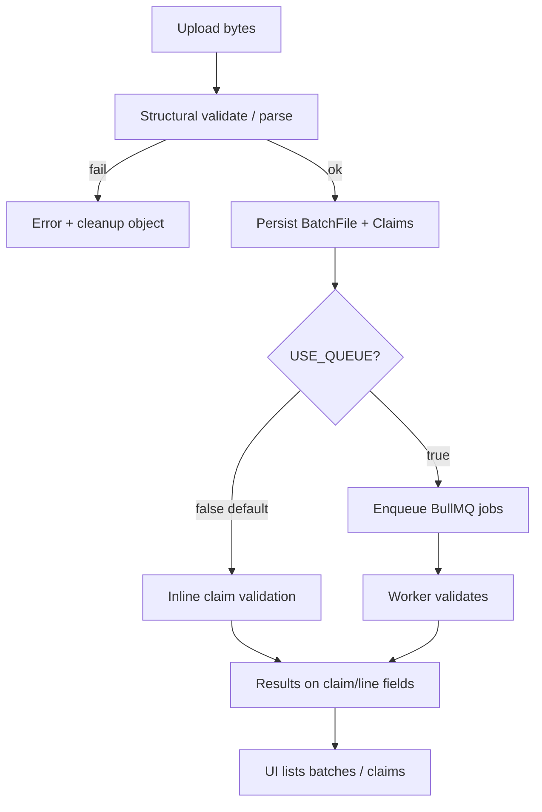

# Batch Lifecycle

```mermaid
flowchart TD
  A[Upload bytes] --> B[Structural validate / parse]
  B -->|fail| X[Error + cleanup object]
  B -->|ok| C[Persist BatchFile + Claims]
  C --> D{USE_QUEUE?}
  D -->|false default| E[Inline claim validation]
  D -->|true| F[Enqueue BullMQ jobs]
  F --> G[Worker validates]
  E --> H[Results on claim/line fields]
  G --> H
  H --> I[UI lists batches / claims]
```

Exact status enums live on Prisma models and batch services — inspect `BatchFile` / `Claim` fields when extending UI badges.

