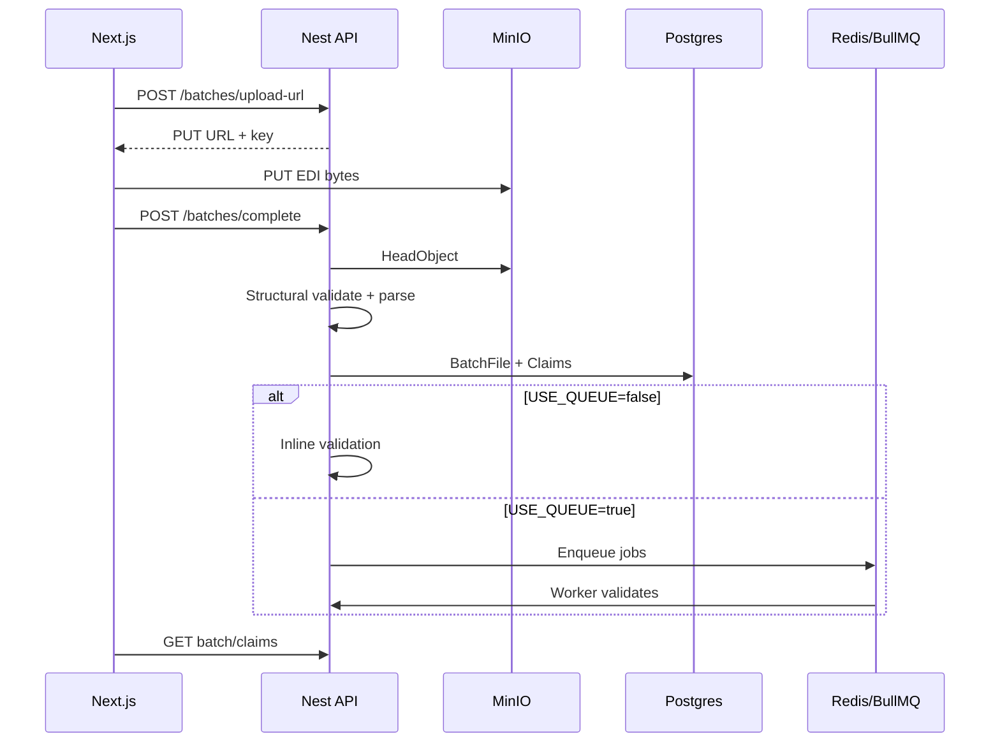

# Data Flow — EDI Batch

```mermaid
sequenceDiagram
  participant UI as Next.js
  participant API as Nest API
  participant S3 as MinIO
  participant DB as Postgres
  participant Q as Redis/BullMQ
  UI->>API: POST /batches/upload-url
  API-->>UI: PUT URL + key
  UI->>S3: PUT EDI bytes
  UI->>API: POST /batches/complete
  API->>S3: HeadObject
  API->>API: Structural validate + parse
  API->>DB: BatchFile + Claims
  alt USE_QUEUE=false
    API->>API: Inline validation
  else USE_QUEUE=true
    API->>Q: Enqueue jobs
    Q->>API: Worker validates
  end
  UI->>API: GET batch/claims
```

