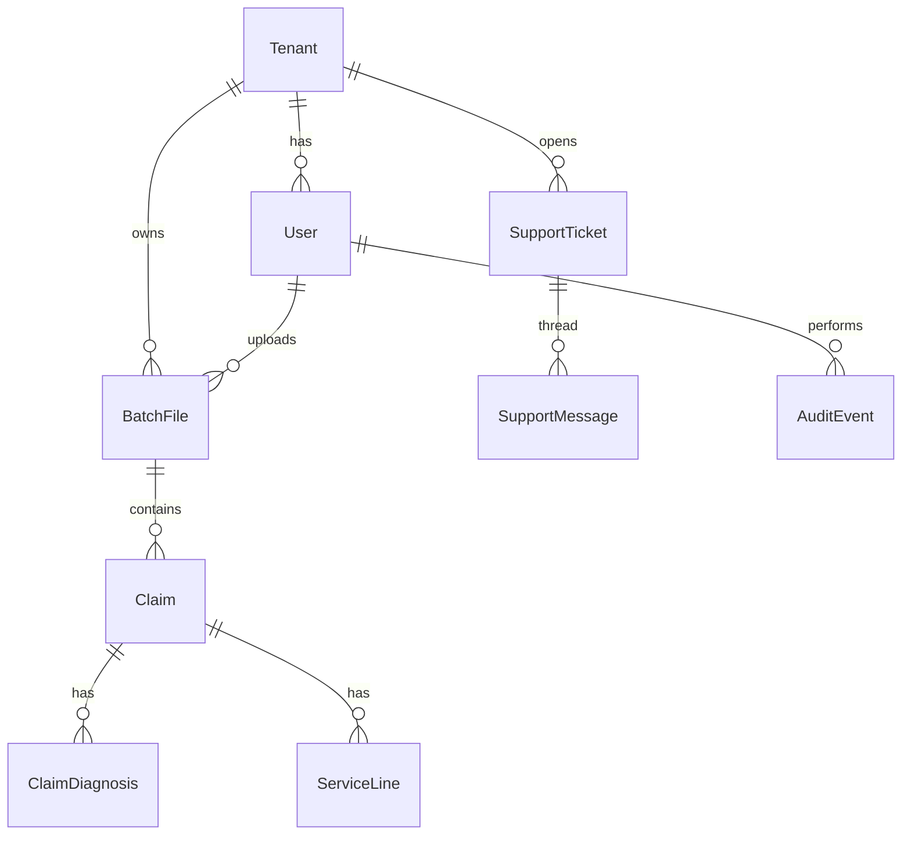

# ERD (Core)

Simplified conceptual diagram — not every reference table:

```mermaid
erDiagram
  Tenant ||--o{ User : has
  Tenant ||--o{ BatchFile : owns
  User ||--o{ BatchFile : uploads
  BatchFile ||--o{ Claim : contains
  Claim ||--o{ ClaimDiagnosis : has
  Claim ||--o{ ServiceLine : has
  Tenant ||--o{ SupportTicket : opens
  SupportTicket ||--o{ SupportMessage : thread
  User ||--o{ AuditEvent : performs
```

Regenerate mental models from Prisma when relationships change.

